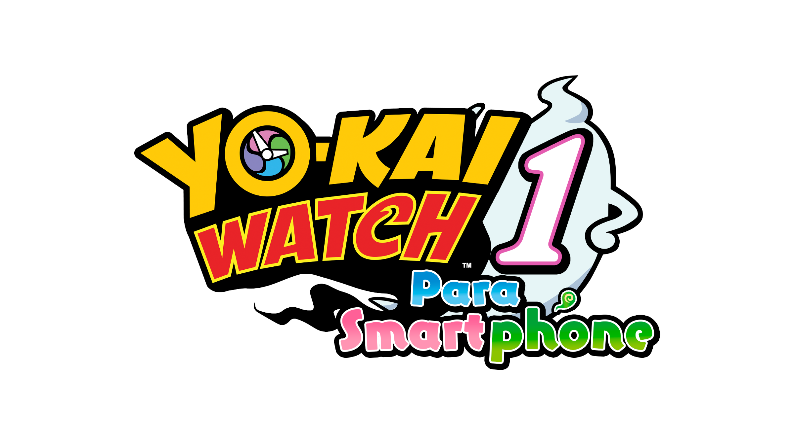
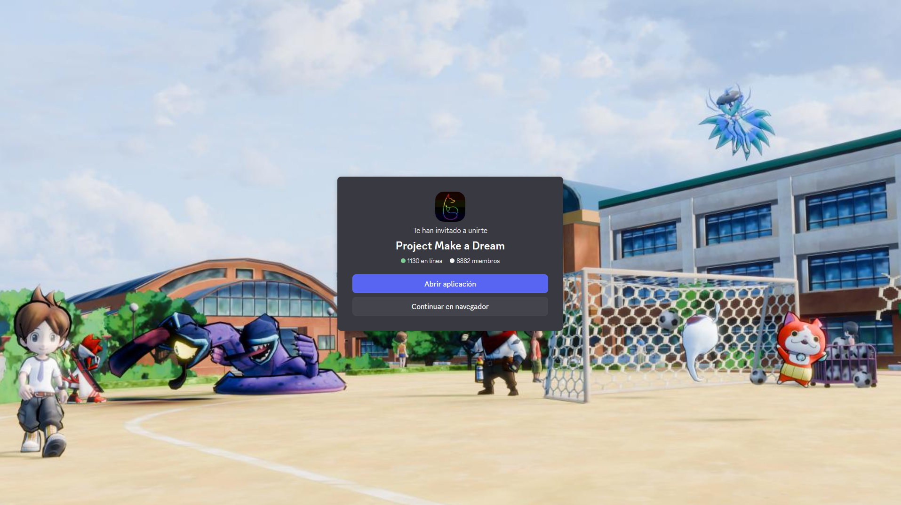

    

# Yo-kai Watch 1 Smartphone Traduccion al Español

Traducción a mano de Yo-kai Watch 1 Smartphone al Español utilizando de base la traducción oficial de 3DS.

> [!IMPORTANT]
> Este proyecto aún está en proceso, si encuentras algún error o algo que se deba arreglar abre un [**issue**](https://github.com/Chip_LG08/YKW1MESP/issues) o reportalo en el servidor de Discord.
__**Es necesaria la actualización 1.0.11 o 1.0.12 del juego para que todo funcione sin errores.**__

> [!NOTE]
> **Versión actual: 1.5**

# Guía de compra

Puedes ver una guía sobre como comprar el juego tanto para Android como para iOS [**aquí**](https://github.com/ChipLG08/YW1MESP/blob/main/Como%20comprar%20el%20juego.txt)).

# Instalación de la traducción

### Android: 
1. Consigue una copia del juego (no importa su fuente) e instálala en tu dispositivo.

2. Instala la última versión disponible de [**Enma Patcher**](https://github.com/hxgohxrr/Enma-Patcher/releases)

3. Una vez instalada la app, abrela y verás varias opciones. En caso de que tu apk proceda de fuentes no oficiales solo dale a **Parchear**.

4. Si tu juego fue comprado desde la Play Store, también deberás proporcionar un drm bypass.

5. Desde Enma Patcher selecciona la rueda de ajustes y ve a donde dice **DRM Bypass**, selecciona la ruta donde está el archivo y dale a guardar.

6. Vuelve al menú principal y selecciona **Parchear**. 

7. Una vez la app se acabe de parchear deberás borrar la versión de la app que tengas instalada.

8. Por último, vuelve al Enma Patcher e instala la APK.

# Créditos

Lider de la traducción de YW1 Smartphone y traductor de textos: Chip_LG08

Editor de imágenes: VictorFco

Creador del Enma Patcher (Herramienta de parcheo) + half width patch: hxgohxrr

# PROJECT MAKE A DREAM

Make a Dream es un servidor de Discord en el que están varias de las traducciones de los juegos de Yo-kai Watch al español, mangas, y fan-games hechos por la comunidad.
Cualquier duda en el servidor, siempre contestamos.

> [Discord](https://discord.gg/project-make-a-dream-846980324034347008)

